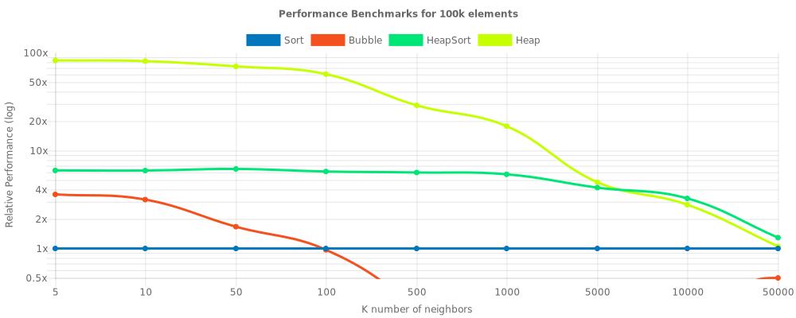

# k-closest
Robust neighbor search module with multiple implementations optimized for space and time complexities. See [benchmarks.md](https://github.com/georgegach/k-closest/blob/master/scripts/logs/benchmark.md) for more information. 


## Installation
Grab it via NPM:
```bash
npm install --save k-closest
```
Or insert it into HTML like: 
```html
<script src="https://cdn.jsdelivr.net/gh/georgegach/k-closest/lib/index.umd.js"></script>
<script>
    var closest = new kc.Seeker(Array.from({ length: 50 }, () => Math.floor(Math.random() * 100)))
    console.log(closest.get(42, 5))
</script>
```


## Usage
```javascript
const Seeker = require('k-closest').Seeker;
const closest = new Seeker(
    Array.from({ length: 50 }, () => Math.floor(Math.random() * 100)) // some random array
)

console.table([
    {
        'Method': 'Single',
        'Results': closest.single(42)
    },
    {
        'Method': 'Auto',
        'Results': closest.get(42, 5)
    },
    {
        'Method': 'with HeapSort',
        'Results': closest.wHeapSort(42, 5)
    },
    {
        'Method': 'with MaxHeap',
        'Results': closest.wHeap(42, 5)
    },
    {
        'Method': 'with Sort',
        'Results': closest.wSort(42, 5)
    },
    {
        'Method': 'with BubbleSort',
        'Results': closest.wBubble(42, 5)
    },
])    
```
```bash
$ node .\scripts\playground.js

┌─────────┬───────────┬────────────────────────┐
│ (index) │  Method   │        Results         │
├─────────┼───────────┼────────────────────────┤
│    0    │ 'Single'  │            43          │
│    1    │  'HeapN'  │ [ 43, 43, 40, 49, 50 ] │
│    2    │  'HeapK'  │ [ 43, 43, 40, 49, 50 ] │
│    3    │  'Sort'   │ [ 43, 43, 40, 49, 50 ] │
│    4    │ 'BubbleK' │ [ 43, 43, 40, 49, 50 ] │
└─────────┴───────────┴────────────────────────┘
```
For common data types such as Numbers, 1D/2D/3D/ND Number arrays and RGB object arrays `Seeker.recommendedDiff()` is taking care of to provide a comparator. However, generally, it's best to define one yourself such as: 

```javascript
const closest = new Seeker(
    HTML_COLORS, // available in scripts/tests.js 
    (a,b) => (
        Math.pow(a.r - b.r, 2) +
        Math.pow(a.g - b.g, 2) +
        Math.pow(a.b - b.b, 2)
    ) // euclidean distance of RGB values
)

console.table(
    closest.get({
        r: 255, g: 255, b:255
    }, 3)
)
```
```bash
$ node .\scripts\playground.js

┌─────────┬──────────┬───────────┬─────┬─────┬─────┐
│ (index) │   name   │    hex    │  r  │  g  │  b  │
├─────────┼──────────┼───────────┼─────┼─────┼─────┤
│    0    │ 'White'  │ '#FFFFFF' │ 255 │ 255 │ 255 │
│    1    │ 'Silver' │ '#C0C0C0' │ 192 │ 192 │ 192 │
│    2    │  'Gray'  │ '#808080' │ 128 │ 128 │ 128 │
└─────────┴──────────┴───────────┴─────┴─────┴─────┘
```

For more examples check out [./scripts/benchmark.js](https://github.com/georgegach/k-closest/blob/master/scripts/benchmark.js) and [./scripts/tests.js](https://github.com/georgegach/k-closest/blob/master/scripts/tests.js).


## Methodology
> Given an array of elements, find K closest (farthest) items from the target element.

> Given an array of numbers, find K smallest (largest) numbers. (Abstraction: You can just assume that the target element is 0 or N)

The simplest, and usually 2-liner, approach to closest neighbor selection is to sort the array by the difference with respect to target and output first `K` elements in `O(NLogN + K)` time. This method performs the worst but is exposed to api via `Seeker.wSort(item, k)` function for benchmarking purposes.

Next natural approach is to just find minDistances K times while extracting each in a temporary array. Essentially this is a variation of BubbleSort where outer loop only runs `K` times and guarantees to find `K` smallest elements. Time complexity: `O(NK)`. This method is memory efficient but performs only slightly better than `Seeker.wSort`. Method is exposed to API via `Seeker.wBubble(item, k)` 

The most robust approach in the package is `Seeker.wHeap(item, k)`. Essentially in this approach the MaxHeap acts as a temp array that is gathering candidates. Each item is compared to the root of MaxHeap that is the current farthest candidate from the target and will be replaced if coming element's distance is less. Finally, when done, extract elements and reverse the array. This guarantees to always have K elements in the Heap giving drastic advantage not only in speed but space as well. Running time performance is `O(K + (N-K)LogK)` and according to our benchmarks usually performs best.

The only rival to previous approach is again Heap itself. `Seeker.wHeapSort(item, k)` builds the heap in `O(N)` and just extracts the elements in `O(KLogN)` time. Although this method requires much more space, according to benchmarks, HeapSort-based method is superior when `K` is substantially large with respect to `N`. Total running time `O(N + KLogN)`.  


## Performance benchmarks
See in detail at [benchmarks.md](https://github.com/georgegach/k-closest/blob/master/scripts/logs/benchmark.md)

