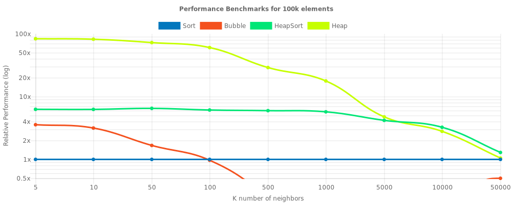

# Performance benchmarks
Following benchmarks were executed on `Sun Nov 04 2018` with `k-closest@1.2.0`
```
> System information

Intel® Core™ i7-8700K 3.70 GHz (12 cores)
Ubuntu (x64) 18.04
```
## Overview


## N=100000
```
> Generate random dataset of size [100000]
> Check results of the algorithms
> Run benchmarks
```


| Method | **N** Elements | **K** Closest | **S**peed (runs/sec) | Relative Perfomance | Effectiveness (N×K×S×λ) | 
|--------|----------------|---------------|----------------------|---------------------|-------------------------|
| Sort | 100000 | 5 | 36.64 | 1x | 1.83 |
| Bubble | 100000 | 5 | 130.87 | 3.57x | 6.54 |
| HeapSort | 100000 | 5 | 230.25 | 6.28x | 11.51 |
| Heap | 100000 | 5 | 3061.22 | 83.55x | 153.06 |
| Sort | 100000 | 10 | 36.63 | 1x | 3.66 |
| Bubble | 100000 | 10 | 115.87 | 3.16x | 11.59 |
| HeapSort | 100000 | 10 | 229.1 | 6.26x | 22.91 |
| Heap | 100000 | 10 | 3008.55 | 82.14x | 300.85 |
| Sort | 100000 | 50 | 35.17 | 1x | 17.58 |
| Bubble | 100000 | 50 | 58.86 | 1.67x | 29.43 |
| HeapSort | 100000 | 50 | 228.55 | 6.5x | 114.27 |
| Heap | 100000 | 50 | 2553.5 | 72.61x | 1276.75 |
| Sort | 100000 | 100 | 37.05 | 1x | 37.05 |
| Bubble | 100000 | 100 | 36.03 | 0.97x | 36.03 |
| HeapSort | 100000 | 100 | 226.59 | 6.12x | 226.59 |
| Heap | 100000 | 100 | 2241.66 | 60.51x | 2241.66 |
| Sort | 100000 | 500 | 36.74 | 1x | 183.69 |
| Bubble | 100000 | 500 | 9.06 | 0.25x | 45.3 |
| HeapSort | 100000 | 500 | 219.64 | 5.98x | 1098.21 |
| Heap | 100000 | 500 | 1068.13 | 29.07x | 5340.67 |
| Sort | 100000 | 1000 | 36.65 | 1x | 366.48 |
| Bubble | 100000 | 1000 | 4.64 | 0.13x | 46.41 |
| HeapSort | 100000 | 1000 | 209.88 | 5.73x | 2098.84 |
| Heap | 100000 | 1000 | 651.57 | 17.78x | 6515.72 |
| Sort | 100000 | 5000 | 36.22 | 1x | 1811.13 |
| Bubble | 100000 | 5000 | 0.96 | 0.03x | 48.01 |
| HeapSort | 100000 | 5000 | 151.91 | 4.19x | 7595.48 |
| Heap | 100000 | 5000 | 172.24 | 4.76x | 8611.92 |
| Sort | 100000 | 10000 | 35.33 | 1x | 3533.23 |
| Bubble | 100000 | 10000 | 0.5 | 0.01x | 50.3 |
| HeapSort | 100000 | 10000 | 114.92 | 3.25x | 11492.07 |
| Heap | 100000 | 10000 | 98.78 | 2.8x | 9877.72 |
| Sort | 100000 | 50000 | 29.31 | 1x | 14653.5 |
| Bubble | 100000 | 50000 | 0.13 | 0x | 63.56 |
| HeapSort | 100000 | 50000 | 37.94 | 1.29x | 18969.19 |
| Heap | 100000 | 50000 | 30.92 | 1.05x | 15458.53 |


Total benchmark time: `5 minutes`
